<p align="center" >
  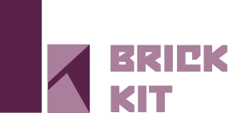
</p>

[](https://travis-ci.org/wayfair/brickkit-ios)
[](http://codecov.io/github/wayfair/brickkit-ios)
[](http://cocoapods.org/pods/BrickKit)
[](http://cocoapods.org/pods/BrickKit)
[](https://github.com/wayfair/brickkit-ios/blob/master/LICENSE)
[](https://github.com/Carthage/Carthage)


# BrickKit is a delightful layout library for iOS and tvOS.  It is written entirely in Swift!


With BrickKit, you can create complex and responsive layouts in a simple way. It's easy to use and easy to extend. Create your own reusable bricks and behaviors.


## Define your layouts using objects that describe the high-level behavior

```swift

let section = BrickSection(bricks: [
    LabelBrick(width: .ratio(ratio: 1), text: "BRICK 1"),
    LabelBrick(width: .ratio(ratio: 1), text: "MULTI-LINE BRICK MULTI-LINE BRICK MULTI-LINE BRICK MULTI-LINE BRICK MULTI-LINE BRICK MULTI-LINE BRICK MULTI-LINE BRICK MULTI-LINE BRICK MULTI-LINE BRICK MULTI-LINE BRICK MULTI-LINE BRICK MULTI-LINE BRICK MULTI-LINE BRICK MULTI-LINE BRICK MULTI-LINE BRICK MULTI-LINE BRICK MULTI-LINE BRICK MULTI-LINE BRICK"),
    LabelBrick(width: .ratio(ratio: 1/2), text: "1/2 BRICK"),
    LabelBrick(width: .ratio(ratio: 1/2), text: "1/2 BRICK"),
    LabelBrick(width: .ratio(ratio: 1/3), text: "1/3 BRICK"),
    LabelBrick(width: .ratio(ratio: 1/3), text: "1/3 BRICK"),
    LabelBrick(width: .ratio(ratio: 1/3), text: "1/3 BRICK"),
    ], inset: 10, edgeInsets: UIEdgeInsets(top: 20, left: 20, bottom: 20, right: 20))

self.setSection(section)


```
### Layout in portrait

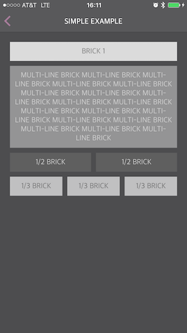
### Layout in landscape

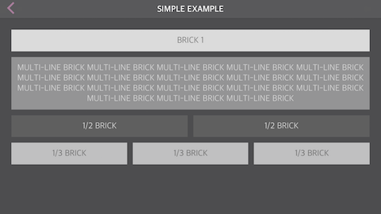

## Define heights based on rules


```swift

// Calculate height using auto-layout
LabelBrick(height: .auto(estimate: .fixed(size: 50)), text: "BRICK"),

// Fixed Height
LabelBrick(height: .fixed(size: 50), text: "BRICK"),

// Calculate height based on ratio of the width
LabelBrick(height: .ratio(ratio: 1), text: "BRICK"),

// Complex Rule based on size classes and/or orientation
let height: BrickDimension =
    .horizontalSizeClass(
        regular: .orientation(
            landscape: .fixed(size: 200),
            portrait: .fixed(size: 100)
        ),
        compact: .orientation(
            landscape: .fixed(size: 100),
            portrait: .fixed(size: 50)
        )
)

```
### Height Ratio portrait
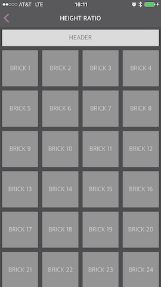
### Height Ratio landscape
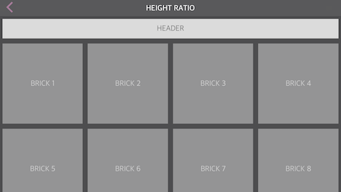

## Complex layouts, using Sections in Sections

```swift

let section = BrickSection(bricks: [
    LabelBrick(width: .ratio(ratio: 0.5), text: "BRICK"),
    BrickSection(width: .ratio(ratio: 0.5), bricks: [
        LabelBrick(text: "BRICK\nBRICK"),
        LabelBrick(text: "BRICK"),
        LabelBrick(text: "BRICK"),
        ], inset: 10),
    BrickSection(bricks: [
        BrickSection(width: .ratio(ratio: 1/3), bricks: [
            LabelBrick(text: "BRICK"),
            LabelBrick(text: "BRICK"),
            ], inset: 5),
        BrickSection(width: .ratio(ratio: 2/3), backgroundColor: .brickGray3, bricks: [
            LabelBrick(text: "BRICK"),
            LabelBrick(text: "BRICK"),
            LabelBrick(text: "BRICK"),
            ], inset: 15),
        ], inset: 5, edgeInsets: UIEdgeInsets(top: 5, left: 5, bottom: 5, right: 5)),
    BrickSection(width: .ratio(ratio: 0.5), bricks: [
        LabelBrick(text: "BRICK"),
        LabelBrick(text: "BRICK"),
        ], inset: 10),
    LabelBrick(width: .ratio(ratio: 0.5), text: "BRICK"),
    LabelBrick(text: "BRICK"),
    ], inset: 10, edgeInsets: UIEdgeInsets(top: 20, left: 20, bottom: 20, right: 20))

self.setSection(section)


```

### Example of Section in Section
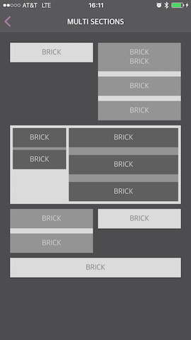

## Create your own reuseable Bricks!

```swift

registerBrickClass(NiblessBrick.self)

let section = BrickSection(bricks: [
    NiblessBrick(text: "BRICK", image: UIImage(named: "logo_splash")!),
    NiblessBrick(width: .ratio(ratio: 1/2), text: "BRICK", image: UIImage(named: "logo_inapp")!),
    NiblessBrick(width: .ratio(ratio: 1/2), text: "BRICK", image: UIImage(named: "logo_inapp")!)
    ], inset: 10)
setSection(section)


```

> BrickKit supports Bricks with Nibs or Nibsless

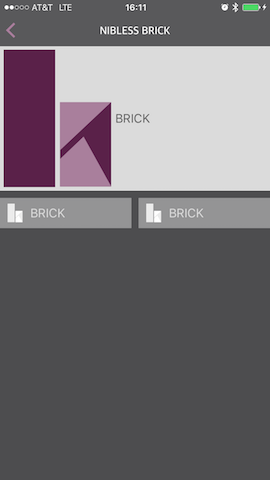

## Use different scroll directions within bricks

```swift
self.registerBrickClass(CollectionBrick.self)
self.registerBrickClass(LabelBrick.self)

let section1 = BrickSection(bricks: [
    ImageBrick(width: .ratio(ratio: 1/4), height: .ratio(ratio: 1), dataSource: self),
    ] , inset: 10, edgeInsets: UIEdgeInsets(top: 5, left: 5, bottom: 5, right: 5))
section1.repeatCountDataSource = self

let section2 = BrickSection(bricks: [
    ImageBrick(width: .ratio(ratio: 1/2), height: .ratio(ratio: 1), dataSource: self),
    ], inset: 10, edgeInsets: UIEdgeInsets(top: 5, left: 5, bottom: 5, right: 5))
section2.repeatCountDataSource = self

let section3 = BrickSection(bricks: [
    ImageBrick(width: .fixed(size: 100), height: .ratio(ratio: 1), dataSource: self),
    ], inset: 10, edgeInsets: UIEdgeInsets(top: 5, left: 5, bottom: 5, right: 5))
section3.repeatCountDataSource = self

let section = BrickSection(bricks: [
    LabelBrick(text: "1/4 Ratio"),
    CollectionBrick(scrollDirection: .horizontal, dataSource: CollectionBrickCellModel(section: section1), brickTypes: [ImageBrick.self]),
    LabelBrick(text: "1/2 Ratio"),
    CollectionBrick(scrollDirection: .horizontal, dataSource: CollectionBrickCellModel(section: section2), brickTypes: [ImageBrick.self]),
    LabelBrick(text: "100px Fixed"),
    CollectionBrick(scrollDirection: .horizontal, dataSource: CollectionBrickCellModel(section: section3), brickTypes: [ImageBrick.self]),
    ])
setSection(section)

```

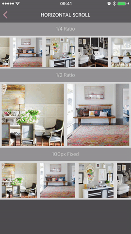

## Dynamic Image Heights

Images are automatically resized based on its content

```swift

registerBrickClass(ImageBrick.self)
registerBrickClass(LabelBrick.self)

let imageURL = NSURL(string:"https://secure.img2.wfrcdn.com/lf/8/hash/2664/10628031/1/custom_image.jpg")!

let section = BrickSection("RootSection", bricks: [
    LabelBrick(text: "Below is an image brick with fixed height"),
    ImageBrick(height: .fixed(size: 50)dataSource: ImageURLBrickModel(url: imageURL, contentMode: .ScaleAspectFit)),
    LabelBrick(text: "Below is an image brick loaded dynamically"),
    ImageBrick(height: .auto(estimate: .fixed(size: 50)), dataSource: ImageURLBrickModel(url: imageURL, contentMode: .ScaleAspectFit)),
    LabelBrick(text: "Below is an image brick with fixed height"),
    ImageBrick(height: .fixed(size: 50), dataSource: ImageURLBrickModel(url: imageURL, contentMode: .scaleAspectFill)),
    ], inset: 10)

self.setSection(section)

```

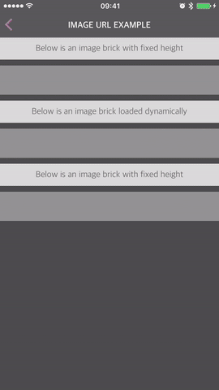

## Advanced Sticky
```swift
...
behavior = StickyLayoutBehavior(dataSource: self)
...

func stickyLayoutBehavior(stickyLayoutBehavior: StickyLayoutBehavior, shouldStickItemAtIndexPath indexPath: NSIndexPath, withIdentifier identifier: String, inCollectionViewLayout collectionViewLayout: UICollectionViewLayout) -> Bool {
    return identifier == BrickIdentifiers.titleLabel
}

```
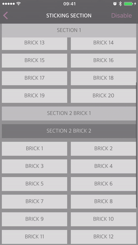

## Coverflow

```swift

layout.scrollDirection = .horizontal

let snapToBehavior = SnapToPointLayoutBehavior(scrollDirection: .horizontal(.Center))
self.brickCollectionView.layout.behaviors.insert(snapToBehavior)
self.brickCollectionView.layout.behaviors.insert(CoverFlowLayoutBehavior(minimumScaleFactor: 0.75))

```

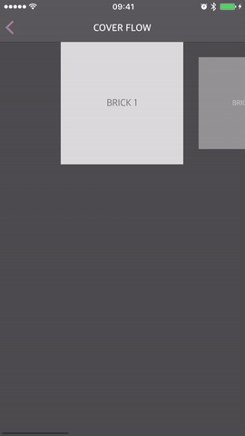

## Appear Behavior (none, bottom, top)

```swift
layout.appearBehavior = BrickAppearTopBehavior() // Insert from the top
layout.appearBehavior = BrickAppearBottomBehavior() // Insert from the bottom

```
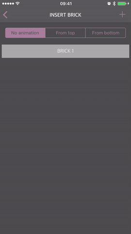

## Spotlight

```swift
...
behavior = SpotlightLayoutBehavior(dataSource: self)
...

func spotlightLayoutBehavior(behavior: SpotlightLayoutBehavior, smallHeightForItemAtIndexPath indexPath: NSIndexPath, withIdentifier identifier: String, inCollectionViewLayout collectionViewLayout: UICollectionViewLayout) -> CGFloat? {
    return identifier == BrickIdentifiers.repeatLabel ? 50 : nil
}

```

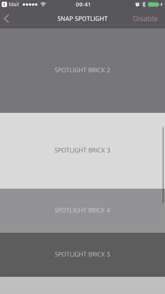

## Features
- Setup is simple, can create a view with a few lines of code.
- Is an alternative implementation of a UICollectionViewController.
- Advanced Width and Height setups, views can be sized according to iPad/screen size upon initialization!
- Allows for the reuse of cells.
  - Supports multiple nibs per BrickCell: UICollectionViewCell class.
- Has "behaviors", which are complex layout interactions that can be applied to any view controller.
  - Sticky Headers/Footers
  - Hide Views
  - Scrolling Behaviors
  - Snap to Point
  - These are all supported by ten lines or less of code!
- Asynchronous changing of height
  - Allows content to flow in after the cell is already on screen.
  - Supports the height of cells to resize after an image or video has loaded.

## Installation Instructions
Installation is simple.  You just need Cocoapods and it is a matter of adding this to your podfile:
```ruby
pod 'BrickKit'
```

See [Installation Details](#Installation Details)

## Terminology

### Brick
The `Brick` object represents the **model** of what needs to be laid out on screen. E.g. in case of a `LabelBrick`, the model should contain the text that should go inside the label.

> We strongly encourage that every `Brick` has a `datasource` and an optional `delegate`. This is a pattern that proves to be successful and allows your brick to be repeated.
> For simple bricks, it is suggested to create a basic BrickModel that subclasses that datasource, so that you do not have to implement the datasource in the viewcontroller.
> For a number of examples on how to implement Bricks, refer to the examples in the BrickKit pod, such as `LabelBrick` or `ButtonBrick`.

### BrickSection
The `BrickSection` provides information for the BrickCollectionView on how to lay out the cells on screen.  In particular, it provides the `identifiers`,
the bricks inside of the BrickSection, as well as `UIEdgeInsets` and an `inset`.

> A `BrickSection` is a subclass of a Brick.  This provides for nesting of multiple BrickSections inside of a BrickSection.  The BrickCollectionView will only accept a single, unified
> BrickSection, so if you want complex layouts you will want to nest BrickSections together.

### BrickCell
The `BrickCell` object is representing the actual **view**. The cell will be instantiated when the view comes on screen and will call its dataSource to obtain information on how to
display itself.

> As BrickKit is based on `UICollectionView`, every `BrickCell` is a subclass of `UICollectionViewCell`.

### BrickCollectionView
A BrickCollectionView, a subclass of `UICollectionView`, manages the brick section/sections. It is also responsible for loading the correct `BrickCell` for a given brick.

> You'll need to register every brick that is used in the BrickCollectionView. (`brickCollectionView.registerBrickClass(LabelBrick.self)`)
> If you fail to do so, the app will crash (with a descriptive message)
> Note, a CollectionBrick is a brick that houses a BrickCollectionView.  If you implement one of these, you will have to register the brickClass in the CollectionBrick's BrickCollectionView or you will crash with a nib not found error.

### BrickLayout
An object that implements the `BrickLayout` protocol is responsible for the displaying of the BrickCells on the BrickCollectionView.

### BrickFlowLayout
A BrickFlowLayout is an implementation of the BrickLayout protocol.

> A BrickFlowLayout is a subclass of a UICollectionViewLayout.

### BrickDimension
A `BrickDimension` is something you provide upon the initialization of a brick.  This is where the magic happens.
BrickDimensions allow for widths and heights to be based off of view size or a fixed value. Then can then also be dependent on your horizontal or vertical size class, your orientation, or you can
simply leave it as automatic and let auto layout do its thing.

### BrickRepeatCountDataSource
A `BrickRepeatCountDataSource` allows you to specify a repeat count for a certain brick.  This will give your `BrickCell` an index, similar to how arrays are setup.

## Implementation Details
Ideally, a Brick has an identifier. This identifier can be used to refer back to a certain Brick.
The advantage of this over using `NSIndexPath` is that it decouples the model from the layout.
This allows you to use the same brick, datasource, and delegate for a cell.

BrickKit comes with some useful default brick implementations:

- [LabelBrick](Docs/Bricks/LABEL_BRICK.md)
- [ButtonBrick](Docs/Bricks/BUTTON_BRICK.md)
- [ImageBrick](Docs/Bricks/IMAGE_BRICK.md)
- [CollectionBrick](Docs/Bricks/COLLECTION_BRICK.md)

The root object used in BrickKit is a [BrickSection](Docs/BRICK_SECTION.md)

The following code will create a label that is:
- The full width of the view.
- Its height will dynamically resize based on the text that is inside of the label.
- The above two conditions are dependent on the nib's constraints being setup correctly, without any specific heights or width set.

```
 --------------------------------
 |         LABEL BRICK          |
 --------------------------------
```

```swift
import UIKit
import BrickKit

class ViewController: BrickViewController {

    override func viewDidLoad() {
        super.viewDidLoad()

        let section = BrickSection(bricks: [
            LabelBrick(text: "LABEL BRICK")
            ])

        self.setSection(section)
    }
}
```

Bricks are sized using auto layout. If the constraints are setup to grow vertically, the brick will get the proper height as needed.
So in case of a label, when the text is larger than the width, it will use the next line.

```
 --------------------------------
 | LABEL BRICK LABEL BRICK LABEL |
 |       BRICK LABEL BRICK       |
 --------------------------------
```

```swift
let section = BrickSection(bricks: [
	LabelBrick(text: "LABEL BRICK LABEL BRICK LABEL BRICK LABEL BRICK")
])
```
Try it in the LabelBrickPlayground.

### BrickDimension
To setup the dimensions of a brick, please refer to [BRICK_DIMENSION.md](Docs\BRICK_DIMENSION.md).

### BrickRepeatCountDataSource
BrickRepeatCountDataSources are setup based off a section.  They can be set upon any `BrickSection`.

```swift
import UIKit
import BrickKit

class ViewController: BrickViewController {

	var fruits: [Fruit] = []

    override func viewDidLoad() {
        super.viewDidLoad()

        fruits.append(Fruit(name: "Apple"))
        fruits.append(Fruit(name: "Banana"))
        fruits.append(Fruit(name: "Cherry"))

        let section = BrickSection(bricks: [
            LabelBrick("FRUIT", text: "BRICK 1")
        ])

        section.repeatCountDataSource = self

        self.setSection(section)
    }

}

extension ViewController: BrickRepeatCountDataSource {

    func repeatCount(for identifier: String, with collectionIndex: Int, collectionIdentifier: String) -> Int {
        return identifier == "FRUIT" ? fruits.count : 1
    }
}
```
Try it in the BrickRepeatCountPlayground.

## Layout

### HideBehavior
This behavior allows you to hide bricks and sections.

### BrickAppearBehavior
A behavior that defines the direction where bricks are appearing and disappearing from.

>  `BrickAppearBehavior ` is extendable, so you can create your own behavior

### BrickLayoutZIndexBehavior
A behavior that determines how the bricks are laid out on the z-Axis. This is very important when dealing with behaviors that allow intersections between bricks

|  Behavior  |    Description    |
|------------|:-----------------:|
|   TopDown  |  The cell at the top has the highest zIndex. Ideal for layouts that need `Sticky` cells, where a `Brick` needs to be displayed above all other bricks.
|  BottomUp  |  The cell at the bottom has the highest zIndex. Ideal for layouts where the lower cells are above the higher cells.


## Behaviors
A behavior changes the way a brick is displayed on screen. This can depend on scrolling, refreshing etc

BrickKit comes with a few behaviors built in:

| Behavior   |      Description  |
|----------|:-------------:|
| StickyLayoutBehavior |  Allows bricks and sections to `stick` to the top of the screen. The brick will stick until its containing section is passed.
| MinimumStickyLayoutBehavior |  Same as the `StickyLayoutBehavior`, but the height of the brick will first shrink to a minimum value before it starts sticking.
| StickyFooterLayoutBehavior |  Allows bricks and sections to `stick` to the bottom of the screen. The brick will stick until its containing section is passed.
| OnScrollDownStickyLayoutBehavior |  Same as the `StickyLayoutBehavior`, but the bricks will only stick when scrolling back up. When scrolling down, the brick will just flow with the other bricks.
| SnapToPointLayoutBehavior |  After scrolling, this behavior will snap your ScrollView to a given location. This is useful if you want bricks to snap to a point after the user is done scrolling.
| SpotlightLayoutBehavior | While scrolling, the brick 'in the spotlight' will grow.  Only one brick is in the spotlight at a time.
| CardLayoutBehavior |  The bricks will scroll like a stack of cards.  The ScrollView will not scroll until one card is completely on top of the other.
| CoverFlowLayoutBehavior |  While scrolling, the brick closest to the center of the screen will grow bigger while the other bricks will shrink.
| OffsetLayoutBehavior |  Allows an offset to the origin or size of bricks.
| MaxZIndexLayoutBehavior |  Allows a brick to be set to the maxZIndex, which means they will always be on top of any other brick.
| SetZIndexLayoutBehavior |  Allows the layout to set the ZIndex of any brick to any value.

> `BrickLayoutBehavior` is extendable, so are free to create your own behaviors.


## Requirements

- iOS 9.1+ / tvOS 9.0+
- Xcode 8.0+
- Swift 3.0 (Swift 3.2 compatible)

## Communication

- If you **found a bug**, open an issue.
- If you **have a feature request**, open an issue.
- If you **want to contribute**, submit a pull request.

## Installation Details

### CocoaPods

[CocoaPods](http://cocoapods.org) is a dependency manager for Cocoa projects. You can install it with the following command:

```bash
$ gem install cocoapods
```


To integrate BrickKit into your Xcode project using CocoaPods, specify it in your `Podfile`:

```ruby
source 'https://github.com/CocoaPods/Specs.git'
platform :ios, '10.0'
use_frameworks!

target '<Your Target Name>' do
    pod 'BrickKit'
end
```

Then, run the following command:

```bash
$ pod install
```

### Carthage

[Carthage](https://github.com/Carthage/Carthage) is a decentralized dependency manager that builds your dependencies and provides you with binary frameworks.

You can install Carthage with [Homebrew](http://brew.sh/) using the following command:

```bash
$ brew update
$ brew install carthage
```

To integrate BrickKit into your Xcode project using Carthage, specify it in your `Cartfile`:

```ogdl
github "wayfair/brickkit-ios"
```

Run `carthage update` to build the framework and drag the built `BrickKit.framework` into your Xcode project.

## Credits

BrickKit is owned and maintained by [Wayfair](https://www.wayfair.com).

## Code of Conduct

See [CODE\_OF_CONDUCT.md](CODE_OF_CONDUCT.md).

## Contributing

See [CONTRIBUTING.md](CONTRIBUTING.md).


## License

BrickKit is released under the Apache license. See LICENSE for details.
